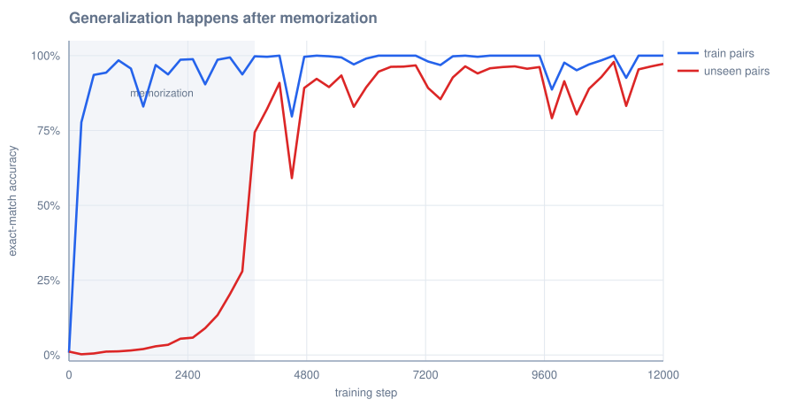
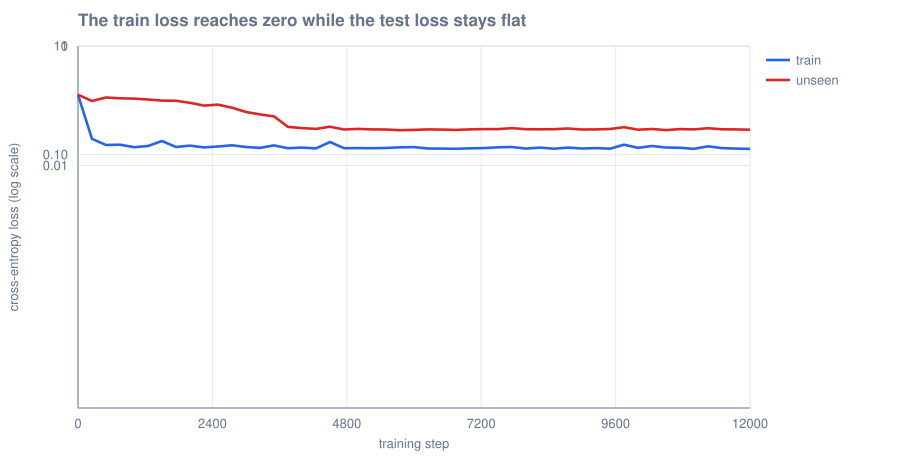

# Grokking in a tiny transformer

This repository is the companion code for the article
**[Attention and grokking: a tiny transformer that learns the rule](https://jacano.github.io/blog/attention-and-grokking-tiny-transformer/)**.

It trains a small transformer on one arithmetic task and shows the moment when the
model stops memorizing and starts generalizing. The experiment is 329 lines in total:
the task, the model, the training loop and the figures. A framework carries the
automatic differentiation, so there is no derivative to read here — the model is 55
lines and the training loop is 12, and both are in `src/Program.cs`.

| | this repository | what a framework replaces |
| --- | ---: | ---: |
| model and training | **329 lines** | a list of nodes and a backward pass |
| dependencies | TorchSharp + libtorch | none |
| backward pass | `loss.backward()` | written by hand |
| derivatives | none | written by hand |
| causal mask | one argument | the key cache grows |
| a full run | **26 seconds** | the same run, ten times slower |

What the framework does not remove is the thinking. Two decisions of this run are
worth reading before you change anything: the initialisation, and which of `Adam`
and `AdamW` you are actually calling. Both are in the last section.

## The library

**[TorchSharp](https://github.com/dotnet/TorchSharp)** 0.107, the .NET binding of
PyTorch, with the native build of libtorch 2.10 as the NuGet package
`libtorch-cpu`. There is no C++ compiler in the loop: the native library arrives as
a package.

It is the only serious candidate in .NET for this. `Microsoft.ML.TorchSharp` is a
wrapper for specific NLP scenarios and does not expose a general layer API;
`TensorFlow.NET` is a Keras-like binding with a heavier and less predictable native
dependency; and ML.NET has no autograd for a network you define yourself.

## The model, in full

This is the whole architecture. There is no other file that describes it.

```csharp
public override Tensor forward(Tensor index)
{
    long batch = index.shape[0];
    long length = index.shape[1];
    Tensor positions = arange(length, dtype: ScalarType.Int64, device: index.device);
    Tensor x = _wte.forward(index) + _wpe.forward(positions); // [B, T, C]

    // --- attention: the framework knows how to do this, and how to mask it ---
    Tensor h = RmsNorm(x);
    Tensor q = _wq.forward(h).reshape(batch, length, _heads, _headDim).transpose(1, 2);
    Tensor k = _wk.forward(h).reshape(batch, length, _heads, _headDim).transpose(1, 2);
    Tensor v = _wv.forward(h).reshape(batch, length, _heads, _headDim).transpose(1, 2);
    Tensor attended = scaled_dot_product_attention(q, k, v, is_casual: true);
    x = x + _wo.forward(attended.transpose(1, 2).reshape(batch, length, _embd));

    // --- MLP: project up, run the non-linearity, project back ---
    x = x + _fc2.forward(relu(_fc1.forward(RmsNorm(x))));
    return _lmHead.forward(x); // [B, T, vocab]
}
```

The three lines that replace the whole backward pass:

```csharp
Tensor loss = lossFn.forward(logits.reshape(-1, Vocab), targets.reshape(-1));
loss.backward();
optimiser.step();
```

And the two that replace the optimizer:

```csharp
using var optimiser = optim.Adam(model.parameters(), lr: lr, beta1: 0.85, beta2: 0.99, weight_decay: wd);
```

## The result



| step | train acc | unseen acc | parameter size |
| ---: | ---: | ---: | ---: |
| 0 | 0.8% | 1.1% | 19.1 |
| 1,000 | 98.4% | 1.2% | 21.5 |
| 3,000 | 98.6% | 13.3% | 19.7 |
| 3,500 | 93.8% | 28.0% | 20.2 |
| 3,750 | 99.8% | 74.4% | 18.1 |
| 4,000 | 99.6% | 82.2% | 17.0 |
| 5,000 | 100% | 92.3% | 16.5 |
| 12,000 | 100% | **97.3%** | 16.0 |

The model memorizes the train set by step 1,000, and the unseen accuracy then sits
between 1% and 28% for another 2,500 steps. It jumps to 74% at step 3,750. At the
end the model answers **1,912 of the 1,966 unseen pairs**.




The figure carries two axes, one per curve. The blue line is the size of the
parameters on the left axis. The red line is the accuracy on unseen pairs on the
right axis. The size tells the story: it grows while the model stores 843 answers, and it falls
while the table becomes the expensive option.

## The control

Set the decay to zero and the jump never arrives. The same program, with `--wd 0`:

| step | decay | train acc | unseen acc | size |
| ---: | :--- | ---: | ---: | ---: |
| 12,000 | with | 100% | **97.3%** | 16.0 |
| 12,000 | without | 100% | **0.2%** | 157.1 |
| 60,000 | without | 100% | **0.5%** | 348.2 |

```bash
dotnet run -c Release -- --wd 0
```

The model memorizes every training pair either way. Without the decay the unseen
accuracy is **below the 1.9% of guessing**, and it stays there: five times the
steps, 60,000 of them, move it from 0.2% to 0.5%. The size of the parameters climbs
to 348, more than twenty times the size of the model that learned the rule.

## Reproduce it

You need the .NET SDK 10 or newer. The first build downloads libtorch, which is a
few hundred megabytes.

```bash
git clone https://github.com/jacano/grokking-torchsharp
cd grokking-torchsharp
make run
```

`make` on its own compiles and checks the formatting. `make help` prints the list:

| command | what it does |
| --- | --- |
| `make run` | the full run: 12,000 steps, about half a minute |
| `make control` | the same run with the decay at zero, which never learns the rule |
| `make save` | train and keep the model in `model.pt` |
| `make infer PAIR=12+35` | ask the saved model |
| `make explain PAIR=12+35` | draw every answer it considered for one sum |
| `make validate` | compile and check the style: what you run before a push |
| `make publish MESSAGE="what changed"` | validate, commit and push |
| `make clean` | remove the build output |

Every flag goes through `ARGS`:

```bash
make run ARGS="--p 13 --steps 3000"              # a smaller modulus learns faster
make run ARGS="--steps 40000 --eval-every 100"   # longer run, finer log
make run ARGS="--lr 0.0025"                      # a slower optimiser
```

`make control` writes over the artifacts of `make run`, so it puts the committed ones
back when it finishes. The log is the result, and the table of the two runs is above.

The whole run takes about half a minute. It writes three things:

| Where | What |
| --- | --- |
| `data/train.txt`, `data/test.txt` | the two splits of the dataset, one pair per line |
| `runs/grokking.csv` | the logged numbers of every step |
| `figures/` | the three figures of this article |

## Inference

`model.pt` is **not part of the repository**. `make save` writes it at the end of a run
and `make infer` reads it back. This is one line in each direction, because a framework
keeps the whole state dictionary for you:

```bash
make save                      # train, then write model.pt
make infer PAIR=12+35
```

```
inference 12+35 = 47  [ok]  top: 47 (90%), 6 (5%), 17 (3%)
inference 7+44 = 51  [ok]  top: 51 (95%), 28 (2%), 39 (2%)
inference 50+50 = 5  [wrong]  top: 5 (74%), 17 (10%), 47 (7%)
inference 0+13 = 13  [ok]  top: 13 (96%), 1 (2%), 43 (0%)
```

One of the four is wrong, and that is the honest number: the model answers 97.3% of
the unseen pairs, so roughly one pair in forty fails. `50 + 50` is one of the 1,966
pairs the model never saw.

## What the model is thinking

A model does not answer a question, it spreads a chance over the options. `make explain
PAIR=12+35` writes the 53 probabilities the saved model gives to one sum
(`runs/probabilities.csv`) and draws them (`figures/grokking-probabilities.svg`).

| the saved model | chance it gives to the right answer, 47 |
| --- | ---: |
| after 1,000 steps, when it has memorized | 0.3% |
| after 12,000 steps, when it has the rule | **89.8%** |

The first model is not undecided. It is sure of another answer, at 40%, which is why the
unseen accuracy sits **below** the 1.9% of guessing in the control below: a model that
memorized is confidently wrong about everything it did not store.

`make explain NOTE="after 1,000 steps"` puts your own words in the title, which is how
the two rows above were drawn.

## What the framework does not do

The framework removes the arithmetic, not the decisions. You still choose the
architecture, the split, the number of steps, the learning rate and the weight
decay, and the run still has to be tuned. Two of the things this repository had to
get right:

- **The initialisation.** A framework starts an embedding at `N(0, 1)` and a linear
  layer in a uniform range. The article uses microgpt's `N(0, 0.08)`, so this file
  sets it in four lines. Measured by the size of the parameters, the run then starts at 19.1 instead of 69.6.
- **The decay is not the same decay.** `AdamW` subtracts the decay from the weight
  outside the update, and `Adam` adds it to the gradient, as microgpt does. With
  `AdamW` this run never jumped, at any decay from 0.002 to 0.5; the parameter norm
  settled at 40 to 50 and the model stayed on the memorizing answer. With `Adam` and the decay inside the gradient, **`wd = 0.0012` works**, and the norm settles at 16. Two names for the same word, two different
  runs.

The framework also brings its own random numbers, so the seed decides the initial weights and the split of the pairs. Change the seed and you get a different run of the same experiment: the jump moves, and the rule arrives just the same.
